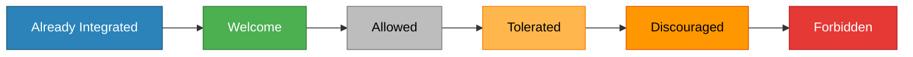

# Introduction
AI (artifical intelligence) tools are becoming a common part of modern development workflows. This guidance helps project maintainers and contributors communicate expectations around AI use clearly and respectfully.

## For Maintainers: Setting AI Expectations

As a maintainer, you define how AI tools fit into your project’s workflow. Clear expectations help contributors understand what’s acceptable and ensure consistency across contributions.

### AI Policy Scale

Projects vary on how much they embrace and allow AI. This chart illustrates that:



### How to communicate your policy

There are different ways to communicate your AI policy to contributors. Here are some:

* Add AI policy to README
* Include the policy in CONTRIBUTING.md
* Use issue templates to ask about AI usage
* Create labels like `ai-assisted` or `no-ai`

## For Contributors: Using AI Responsibly

AI tools can be powerful aids for learning, productivity, and creativity — but they also introduce risks if used carelessly. Contributors are ultimately responsible for the quality, security, and originality of the work they submit.

How to indicate AI tool usage in pull requests:

- Add a short note in your PR description if any part of the submission was generated or assisted by an AI tool.

Example:

```markdown
_This pull request includes code suggestions from ChatGPT, reviewed and validated by the contributor._
```

Example PR descriptions with disclosure:

- ✅ AI‑assisted (reviewed): “Implemented new sort function with help from an AI tool; logic verified locally.”

- ⚠️ AI‑generated (minimal review): “Generated README section using an AI model. Requires human editing.”

Co‑authored‑by conventions for AI tools:

If your project or Git platform supports it, you can optionally note AI involvement in commit metadata — but remember that AI systems cannot be credited as formal authors under most contribution policies.

Example:

	Co-authored-by: AI Assistant (via tool name)

This practice ensures transparency while acknowledging your role as the responsible human contributor.


---

### 🧪 Quality Over Quantity


AI assistance should improve quality — not inflate contribution counts.


- Don’t use AI for spammy or mass contributions. Each PR should have clear, meaningful value.

- Understand the code you submit. If an AI tool suggested something, make sure you know what it does.

- Test everything thoroughly. Run linting, unit tests, and manual validation before proposing changes.

Remember: maintainers must be able to trust that contributors understand and stand behind their submissions.


---

### 💡 When AI Is Helpful


AI tools can responsibly support open‑source work in many valid ways:


- Learning unfamiliar syntax or frameworks — understanding concepts faster.

- Assisting with documentation — drafting summaries, explanations, or examples.

- Providing alternative approaches in code review — comparing efficiency or readability.

- Debugging support — helping identify possible issues or paths to resolution.

Used thoughtfully, AI can accelerate learning and productivity while keeping human judgment central.


---

### 🚫 When to Avoid AI


There are times when AI tools should not be used in contributions:


- Security‑sensitive code or infrastructure — AI may generate unsafe or unverifiable logic.

- Projects that explicitly forbid AI involvement — always respect the repository’s stated policy.

- Content with potential legal, licensing, or copyright implications — ensure no generated output includes proprietary or copyrighted material.

If you’re unsure, ask the maintainers — it’s better to confirm expectations than risk violating a project’s rules.

## Best Practices

AI is a tool in the toolbox, NOT a replacement for developers or reviewers. Continue to learn and make meaningful contributions like you would before AI.

Communication is more important than ever. Be clear with what you're doing, how you got where you are now, and what your plan is going forward. AI can help with tedious tasks and scaffolding-but be sure to respect the projects guidelines and only use it where it's applicable.

## Example Templates

🧩 Sample CONTRIBUTING.md → AI Policy Text

Use this section (or adapt it) in your existing CONTRIBUTING guide.

```markdown
## 🤖 AI Assistance Policy

We recognize that AI tools (e.g., GitHub Copilot, ChatGPT, Claude, Code Whisperer) can increase productivity and learning.  
You may use such tools *responsibly* when contributing to this project if you follow these guidelines:

- **Transparency:** Disclose when AI tools were used to generate or modify code, documentation, or other content.  
- **Accountability:** You remain responsible for verifying, testing, and validating all AI‑generated outputs.  
- **Authorship:** Do not list AI systems as authors or copyright holders.  
- **License and Content Integrity:** Ensure generated output doesn’t violate any license or proprietary content restrictions.  
- **Compliance:** Respect this repository’s declared AI policy level (see README).  
```

---

### 📋 Sample Pull Request Template (`.github/PULL_REQUEST_TEMPLATE.md`)

Including a simple checkbox and optional field streamlines transparent reporting.

```markdown
### 🤖 AI Assistance Disclosure

- [ ] I confirm that **no AI tool** was used in this contribution.
- [ ] I used **AI assistance** while developing this contribution, and I have:
  - [x] Verified and tested all generated output.
  - [x] Confirmed compliance with the repository’s AI usage policy.

If AI tools were involved, please list them:
> (e.g., ChatGPT for generating documentation examples; GitHub Copilot for minor code completions.)

### 🔍 Description
Explain what this PR does and any context maintainers should know.
```
That checkbox prompts contributors to acknowledge the policy directly at submission time.